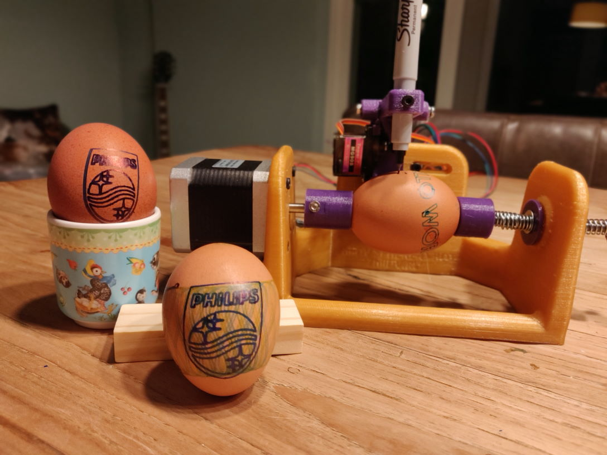

<!-- _class: lead -->
<!-- _paginate: false -->

# <!-- fit --> 🥚🤖

# Egg-bot

---
<!-- _class: lead -->
## My personal egg-painting robot

---

# Why did I create this?

I wanted to show how open-source hardware and software can be used to create "useful" items within days.

.. And I was entering an egg-painting challenge at work 🤓

---

# Inspiration

The egg-bot is to resemble the [JJRobots Sphere-o-bot](https://www.jjrobots.com/sphere-o-bot-jjrobots-version/) where possible..

But adapted to limit 3D printing time, and working on hardware already available in my parts bin.

---
<!-- _class: lead -->
<!-- _paginate: false -->

# <!--fit--> 🛠️

# Intended Hardware platform

---

## Controllers in parts bin

* Arduino Uno
* Arduino leonardo
* Udoo Quad
* Udoo Neo

---

## Electronics

* JJRobots devia board (to be soldered...)
* CNC board
* RAMPS 1.4
* DRV8825 drivers
* A4988 drivers
* some 12v psu 🔌

---

## Other Hardware in parts bin

* 5mm threaded rod
* NEMA17 motors
* SG90
* Skate bearings 🛹

---
<!-- _class: lead -->
<!-- _paginate: false -->

# <!--fit--> 💾

# Sources

---

## JJRobots Sphere-o-bot

The accuracy of the sphere-o-bot is the goal. But the printing time (20+ hrs for base) is more than intended, and the code is based on Arduino Zero (Cortex M0+).

* [JJRobots Sphere-o-bot assembly guide](https://www.jjrobots.com/sphere-o-bot-assembly-and-user-guide/).
* [Thingiverse Sphere-o-bot](https://www.thingiverse.com/thing:1683764)
* [Arduino Zero Sources](https://www.jjrobots.com/wp-content/uploads/2019/10/Ejjduino_M0.zip)
* [Inkscape portable](https://www.jjrobots.com/wp-content/uploads/2020/02/inkscape-Sphere-o-bot.zip)

---

## ZDV Sphere-o-bot

Arduino leonardo + CNC board based. Base is slimmed down, reducing printing time to +-9 hours on 0.2mm smooth settings.

**Note:** [Youtube shots](https://www.youtube.com/watch?v=657EUCRkJw4) suggest plotting accuracy is far lower than the JJRobots version (could this be driver tuning / software?).

* [Thingiverse](https://www.thingiverse.com/thing:2553011)

---
<!-- _class: lead -->
<!-- _paginate: false -->

# <!-- fit --> 🥚🤖
